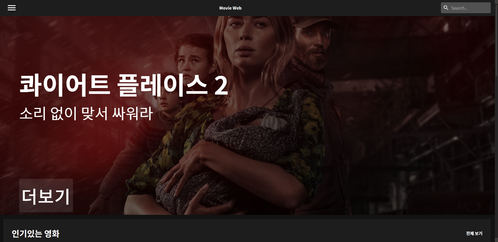
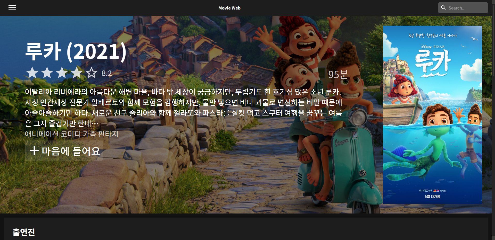
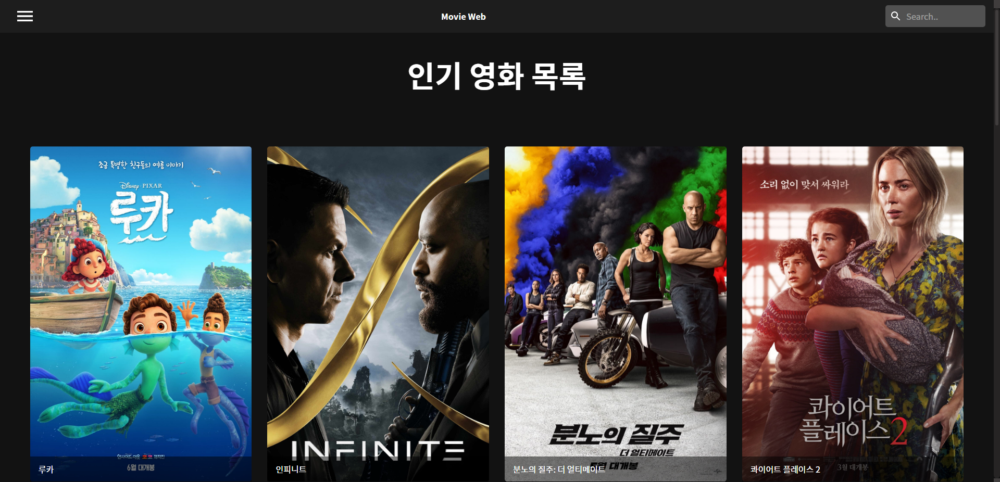
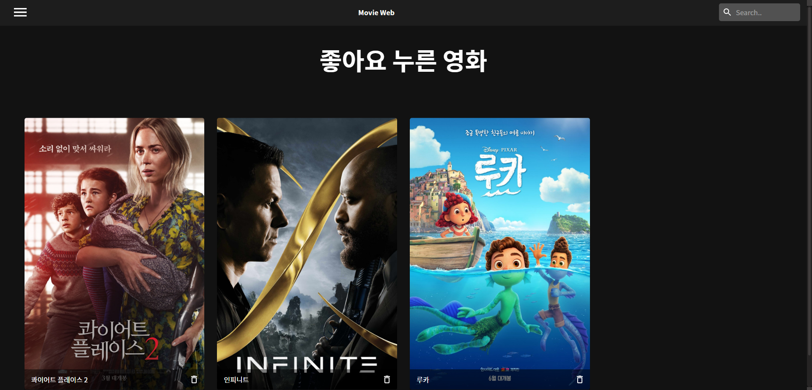

# 🎬Movie Web App

TMDB(The Movie DataBase) API 를 이용해서 만든 리액트 프로젝트로 사용자는 제목으로 영화를 검색하거나 정보를 찾을 수 있다.

기존에 만들었던 [Movie App](https://github.com/tlatjdgh3778/movie)가 마음에 들지 않아서.. 컨셉은 비슷하게 하고 스타일링과 코드를 조금 더 깔끔하게 만든 프로젝트이다.

[사이트 바로가기](https://shim-movie-web-app.netlify.app/)

## 프로토타이핑
우선 프로젝트를 만들기 전에 **Figma**를 사용하여 프로토타이핑을 진행하였다.

[Figma](https://www.figma.com/file/YUtZwzE3uZBGji71j6t48S/Movie-App?node-id=0%3A1)

## 주요 기능
* 인기 영화, 상영중인 영화, 좋은 평가를 받은 영화에 따라 필터링 기능
* 원하는 영화 검색 기능
* 로컬 스토리지를 이용한 좋아요 기능
* 모바일에서도 동작하는 반응형 구현

## 스크린샷
|                메인화면                  |              상세보기                     |
| ---------------------------------------- | ---------------------------------------- |
| | |

|              인기 영화              |           좋아요                 |
| ---------------------------------------- | ---------------------------------------- |
| | |

## 기술스택
* React, react-redux
* Styled-components + Material UI
* TMDB API
* Context API
* Figma

## 프로젝트를 하며 얻은 지식
* Styled-components와 Material UI를 사용하는 방법에 대해 조금 익숙해졌다.
* Context API 를 사용해서 상태 관리하는 방법
* react-redux 를 사용하는 방법

### update 2021.07.26 ~ 27
* 코드 리팩토링
* Context API 대신 react-redux로 상태관리 하도록 리팩토링 함
* ducks pattern 적용
* custom hook 만들어서 관리